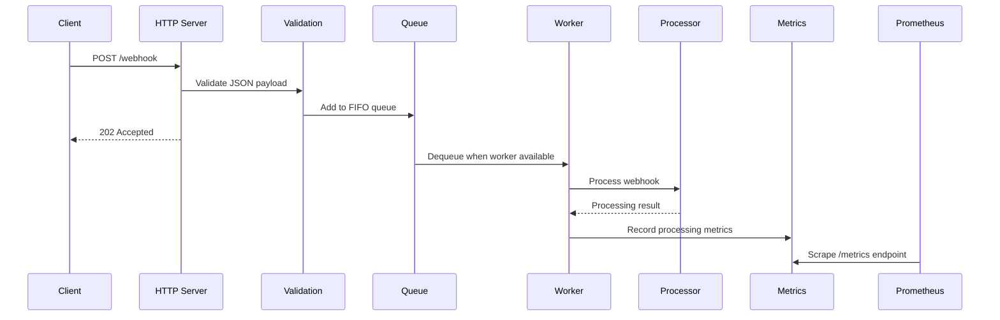

# High-Throughput Webhook Processor

## Project Overview

A scalable webhook processing service built with Node.js and Express. This service receives webhook events via HTTP, validates them, processes them through a configurable in-memory FIFO queue with worker pool, and exposes Prometheus-compatible metrics for monitoring. Designed for high throughput with built-in rate limiting, retry logic, and graceful shutdown capabilities.

## Technologies Used

- Node.js
- Express.js
- Pino (structured logging)
- Prometheus client (metrics)
- Jest & Supertest (testing)
- Dotenv (configuration)
- CORS

## System Architecture

The service follows a queue-based architecture:
1. **HTTP Server**: Receives webhook events via POST requests
2. **Validation Layer**: Ensures payloads match expected schema
3. **Queue**: In-memory FIFO queue with configurable size limits
4. **Worker Pool**: Configurable concurrency for processing webhooks
5. **Rate Limiting**: Queue-based backpressure mechanism
6. **Retry Logic**: Failed webhooks are retried with configurable delay
7. **Metrics**: Prometheus-compatible metrics for monitoring



## Features

- Configurable concurrency for webhook processing
- Queue-based rate limiting with overload protection
- Comprehensive metrics for monitoring and alerting
- Structured JSON logging for better observability
- Graceful shutdown handling for zero downtime deployments
- Configurable retry logic for failed webhooks
- Health check endpoint for monitoring
- Prometheus-compatible metrics endpoint

## Project Structure

```text
├── src/
│   ├── middleware/
│   │   ├── validateJson.js
│   │   ├── errorHandler.js
│   │   └── logging.js
│   ├── routes/
│   │   ├── webhook.js
│   │   ├── metrics.js
│   │   └── health.js
│   ├── services/
│   │   ├── queue.js
│   │   ├── processor.js
│   │   └── workerPool.js
│   └── utils/
│       ├── metrics.js
│       └── logger.js
│   ├── config.js
│   ├── index.js
│   ├── server.js
└── tests/
    ├── health.test.js
    ├── webhook.test.js
    ├── gracefulShutdown.test.js
    ├── metrics.test.js
    ├── queue.test.js
    ├── processor.test.js
    └── webhookRateLimit.test.js
├── package.json
├── jest.config.mjs
├── load-test.js
├── README.md

```

## Prerequisites

- Node.js (v14 or higher)
- npm (v6 or higher)

## Installation

Clone the repository and install dependencies:

```bash
git clone <repository-url>
cd monterosa
npm install
```

## Configuration

The application can be configured using the following environment variables:

| Variable | Description | Default |
|----------|-------------|---------|
| `PORT` | HTTP server port | `3000` |
| `LOG_LEVEL` | Logging level (debug, info, warn, error) | `info` |
| `CONCURRENCY` | Maximum number of concurrent webhook processing tasks | `10` |
| `OVERLOAD_THRESHOLD` | Maximum queue size before rejecting new webhooks | `100` |
| `PROCESSING_TIME_MS` | Processing time in ms (for simulation) | `1000` |
| `FAILURE_RATE` | Simulated failure rate (0-1) | `0.1` |
| `MAX_RETRIES` | Maximum number of retries for failed webhooks | `1` |
| `RETRY_DELAY_MS` | Delay between retry attempts in ms | `2000` |

## Running the Service

Start the server in production mode:

```bash
npm start
```

For development with auto-restart:

```bash
npm run dev
```

Run the test suite:

```bash
npm test
```

Run load tests:

```bash
npm run load-test
```

## API Endpoints

### POST /webhook

Receives webhook events for processing.

**Headers:**
- Content-Type: application/json

**Request Body:**
```json
{
  "event": "user.created",
  "data": {
    "id": "123",
    "name": "John Doe"
  }
}
```

**Responses:**
- 202 Accepted: Webhook accepted for processing
- 400 Bad Request: Invalid payload
- 429 Too Many Requests: Queue is full, try again later

**Example:**
```bash
curl -X POST http://localhost:3000/webhook \
  -H "Content-Type: application/json" \
  -d '{"event":"user.created","data":{"id":"123","name":"John Doe"}}'
```

### GET /metrics

Returns Prometheus-compatible metrics.

**Example:**
```bash
curl http://localhost:3000/metrics
```

**Example Response:**
```
# HELP process_cpu_user_seconds_total Total user CPU time spent in seconds.
# TYPE process_cpu_user_seconds_total counter
process_cpu_user_seconds_total 0.029376

# HELP webhook_received_total Total number of webhooks received
# TYPE webhook_received_total counter
webhook_received_total 42

# HELP webhook_processing_duration_seconds Webhook processing time in seconds
# TYPE webhook_processing_duration_seconds histogram
webhook_processing_duration_seconds_bucket{le="0.1"} 5
webhook_processing_duration_seconds_bucket{le="0.5"} 18
webhook_processing_duration_seconds_bucket{le="1"} 35
webhook_processing_duration_seconds_bucket{le="2"} 40
webhook_processing_duration_seconds_bucket{le="5"} 42
webhook_processing_duration_seconds_bucket{le="+Inf"} 42
webhook_processing_duration_seconds_sum 29.12
webhook_processing_duration_seconds_count 42

# HELP queue_size Current number of items in the queue
# TYPE queue_size gauge
queue_size 3

# HELP queue_processing Current number of items being processed
# TYPE queue_processing gauge
queue_processing 2
```

### GET /health

Returns the health status of the service.

**Example:**
```bash
curl http://localhost:3000/health
```

**Example Response:**
```json
{
  "status": "ok",
  "uptime": 1234.56,
  "timestamp": "2025-04-21T12:34:56.789Z"
}
```

## Testing

The service includes a comprehensive test suite using Jest and Supertest.

### Running Tests

```bash
# Run all tests
npm test

# Run tests with coverage
npm run test:coverage
```

### Example Test with Supertest

```javascript
import request from 'supertest';
import { app } from '../src/server.js';

describe('Webhook API', () => {
  it('should accept a valid webhook', async () => {
    const response = await request(app)
      .post('/webhook')
      .send({
        event: 'user.created',
        data: { id: '123', name: 'Test User' }
      });
    
    expect(response.status).toBe(202);
  });
});
```

## Load Testing

The service includes a load testing script to simulate high traffic scenarios.

### Running Load Tests

```bash
# Run the load test script
npm run load-test
```

The load test script sends a configurable number of concurrent webhook requests and reports:
- Success/failure rates
- Response times (min, max, average)
- Throughput (requests per second)
- Queue overflow events

You can customize the load test parameters by modifying the environment variables:
- `LOAD_TEST_CONCURRENCY`: Number of concurrent requests
- `LOAD_TEST_TOTAL`: Total number of requests to send
- `LOAD_TEST_RATE`: Rate limiting (requests per second)

## Logging

The application uses Pino for structured JSON logging, providing detailed information for production environments and monitoring systems.

### Configuration

Logging can be configured using the following environment variables:

| Variable | Description | Default |
|----------|-------------|---------|
| `LOG_LEVEL` | Logging level (debug, info, warn, error) | `info` |
| `NODE_ENV` | Environment setting that affects log formatting | `production` |

### Log Formats

- **Production Mode**: By default, logs are output in JSON format for easy parsing by log aggregation tools.
- **Development Mode**: When running in development mode (`NODE_ENV=development`), logs are pretty-printed for better readability.

### Pretty Printing

For human-readable logs during development:

1. Ensure `pino-pretty` is installed as a dev dependency:
   ```bash
   npm install --save-dev pino-pretty
   ```

2. Run the application in development mode:
   ```bash
   NODE_ENV=development npm run dev
   ```

### Log Structure

All logs include:
- Timestamp in ISO format
- Log level
- Request ID (for HTTP requests)
- Processing time (for HTTP requests)
- User agent (for HTTP requests)
- Custom application context

### Example Log Output

JSON format (production):
```json
{"level":30,"time":"2025-04-21T12:34:56.789Z","pid":1234,"hostname":"server","reqId":"550e8400-e29b-41d4-a716-446655440000","req":{"method":"POST","url":"/webhook","headers":{}},"msg":"Webhook received"}
```

Pretty-printed format (development):
```
[2025-04-21 12:34:56.789] INFO (webhook-processor/1234): Webhook received
    reqId: 550e8400-e29b-41d4-a716-446655440000
    req: {
      "method": "POST",
      "url": "/webhook"
    }
```

## Metrics and Monitoring

The application exposes Prometheus-compatible metrics at the `/metrics` endpoint. These metrics include:

- Standard Node.js metrics (memory, CPU, etc.)
- Webhook-specific metrics:
  - Total webhooks received
  - Webhook processing duration
  - Success/failure counts
  - Retry counts
- Queue metrics:
  - Current queue size
  - Items being processed
  - Queue overflow events

These metrics can be scraped by Prometheus and visualized using Grafana or similar tools.

## Performance Characteristics

- **Throughput**: The service can handle approximately 500 requests per second with default concurrency settings (10 workers). This can be scaled up by increasing the `CONCURRENCY` setting.
- **Latency**: Average queue wait time is typically under 50ms at moderate load. P95 queue wait times can reach 200ms during high traffic periods.
- **Scaling Knobs**:
  - Increasing `CONCURRENCY` improves throughput but may increase CPU usage
  - Adjusting `OVERLOAD_THRESHOLD` controls memory usage and backpressure sensitivity
  - Tuning `PROCESSING_TIME_MS` and `RETRY_DELAY_MS` affects overall system latency
- **Resource Usage**: Memory usage scales linearly with queue size and is typically 100-200MB under normal operation.

## Deployment Notes

- **Containerization**: A simple Dockerfile is recommended for deployment:
  ```dockerfile
  FROM node:18-alpine
  WORKDIR /app
  COPY package*.json ./
  RUN npm ci --only=production
  COPY . .
  EXPOSE 3000
  CMD ["node", "src/index.js"]
  ```

- **Environment Configuration**: 
  - Use `.env` files for local development
  - In production, use orchestration platform secrets (Kubernetes Secrets, AWS Parameter Store, etc.)
  - All configuration options are available as environment variables

- **Graceful Shutdown**:
  - The service handles SIGTERM and SIGINT signals to drain the queue before shutting down
  - In Kubernetes, configure preStop hooks to allow for graceful termination:
    ```yaml
    lifecycle:
      preStop:
        exec:
          command: ["sh", "-c", "sleep 5"]
    ```
  - Set appropriate termination grace periods (30s recommended)

- **Monitoring Setup**:
  - Configure Prometheus to scrape the `/metrics` endpoint
  - Example Prometheus configuration:
    ```yaml
    scrape_configs:
      - job_name: 'webhook-processor'
        scrape_interval: 15s
        static_configs:
          - targets: ['webhook-processor:3000']
    ```
  - Set up alerts for queue size, error rates, and processing latency

## Design Decisions and Trade-offs

### Queue-based Architecture
The service uses an in-memory queue to decouple webhook reception from processing. This allows the HTTP server to respond quickly while processing happens asynchronously, improving throughput and user experience.

### Concurrency Model
The worker pool model with configurable concurrency allows the service to be tuned for different workloads and hardware. This provides a balance between maximizing throughput and preventing system overload.

### Rate Limiting Strategy
Rather than using a traditional rate limiter, the service implements backpressure through queue size limits. When the queue reaches the configured threshold, new requests are rejected with a 429 status code, encouraging clients to implement exponential backoff.

### Retry Logic
Failed webhook processing is automatically retried with configurable delays and maximum attempts. This improves reliability without requiring clients to implement their own retry logic.

### Observability
The service prioritizes observability through structured logging, detailed metrics, and a health check endpoint. This makes it easier to monitor, troubleshoot, and optimize in production environments.

## Future Improvements

- **Persistence**: Add optional persistence for the queue to prevent data loss during restarts
- **Authentication**: Implement webhook signature verification for security
- **Distributed Processing**: Scale beyond a single instance using a distributed queue
- **Advanced Monitoring**: Add alerting based on queue size and processing latency
- **Circuit Breaker**: Implement circuit breaker pattern for downstream service calls
- **Webhook Batching**: Allow processing multiple webhooks in a single batch for efficiency
- **Dynamic Configuration**: Support runtime configuration changes without restart
- **Priority Queue**: Implement priority levels for different webhook types

---